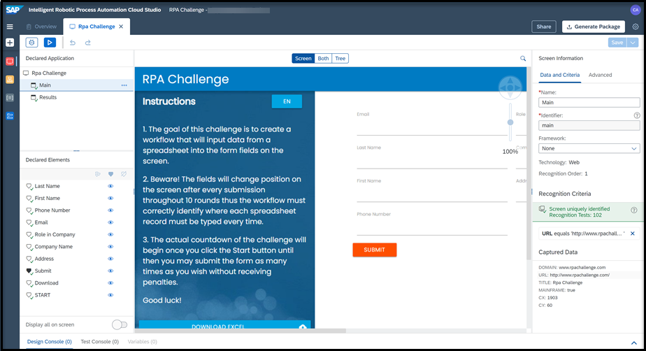

# INT160 - Building a production grade automation in minutes with SAP Intelligent RPA

## Description

This repository contains the material for the SAP TechEd 2021 session called **INT160 - Building a production grade automation in minutes with SAP Intelligent RPA**.

## Overview

This session introduces attendees to SAPs new and simplified Low-Code Cloud Design Studio. Learn how to build a bot to run a very popular RPA Challenge combining a [Web application](http://www.rpachallenge.com) and Microsoft Excel.

## Requirements

A **Windows machine** is required to run the entire workshop.
The requirements to follow the exercises in this repository are described in the [Setup PDF document](exercises/exercise0/Setup%20Trial%20Landscape.pdf).

## Exercises

There are 4 sets of exercises. Exercise 0 is a mandatory setup before executing any exercises. You have to run exercises 1, 2, and 3 in order. These exercises are dependent of each other and the instructions are mentioned in the respective links below.

- [Onboarding to SAP Intelligent RPA Trial](exercises/exercise0/)
    - Duration: 15 minutes. This is a **MANDATORY** exercise that needs to be completed before the workshop.
    - It will help you setup your SAP Business Technology Platform Trial account with SAP Intelligent RPA. 

- [Exercise 1 - RPA Challenge Application Capture](exercises/exercise1/)
    - Duration: 20 minutes 
    - In this exercise, you will learn how to capture an application running on your local machine. You start by locating the screens you want to use. For the purpose of this exercise, you will select and capture two screens from the [RPA Challenge website](http://www.rpachallenge.com). 
    - Once the screens are captured, you will look at the UI elements you want to control on those screens, such as input fields, output fields, and buttons. These elements will be used in the next step : [RPA Challenge Automations](exercises/exercise2/)
    - Another key task is declaration, which means choosing the recognition criteria for the application, screens and UI elements that will be used at run time to correctly identify them.
    

- [Exercise 2 - RPA Challenge Automations](exercises/exercise2/)
- [Exercise 2.1 - First Automation](exercises/exercise2#exercise-21-First-Automation)
    - Duration: 30 minutes 
    - In this exercise, you will learn how to:

- [Exercise 2.2 - Test Download Challenge](exercises/exercise2#exercise-22-Test-Download-Challenge)
    - Duration: 10 minutes 
    - In this exercise, you will learn how to:

- [Exercise 2.3 - Fill Fields Automation](exercises/exercise2#exercise-23-fill-Fields-Automation)
    - Duration: 20 minutes 
    - In this exercise, you will learn how to:

- [Exercise 2.4 - Run RPA Challenge with error and Project Pane](exercises/exercise2#exercise-24-Run-RPA-Challenge-with-error-and-Project-Pane)
    - Duration: 10 minutes 
    - In this exercise, you will learn how to:

- [Exercise 3 - Deployment & Cold debugging](exercises/exercise3/)
    - Duration: 20 minutes 
    - In this exercise, you will learn how to:

## How to obtain support

Support for the content in this repository is available during the actual time of the online session for which this content has been designed. Otherwise, you may request support via the [Issues](../../issues) tab.

## License

Copyright (c) 2021 SAP SE or an SAP affiliate company. All rights reserved. This project is licensed under the Apache Software License, version 2.0 except as noted otherwise in the [LICENSE](LICENSES/Apache-2.0.txt) file.
