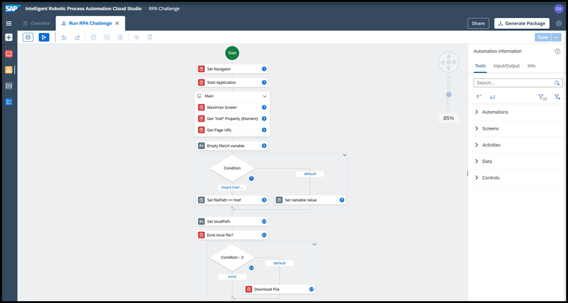
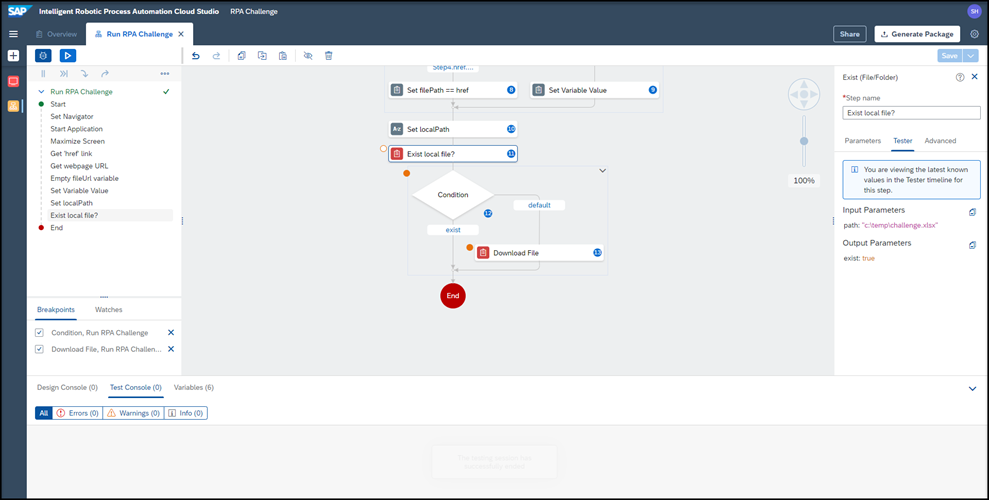
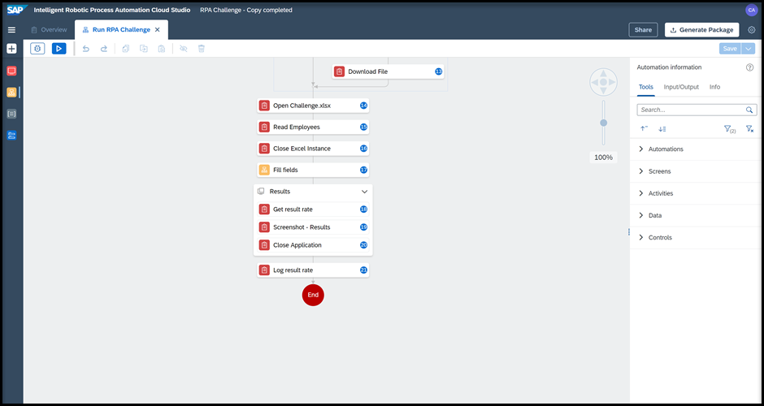
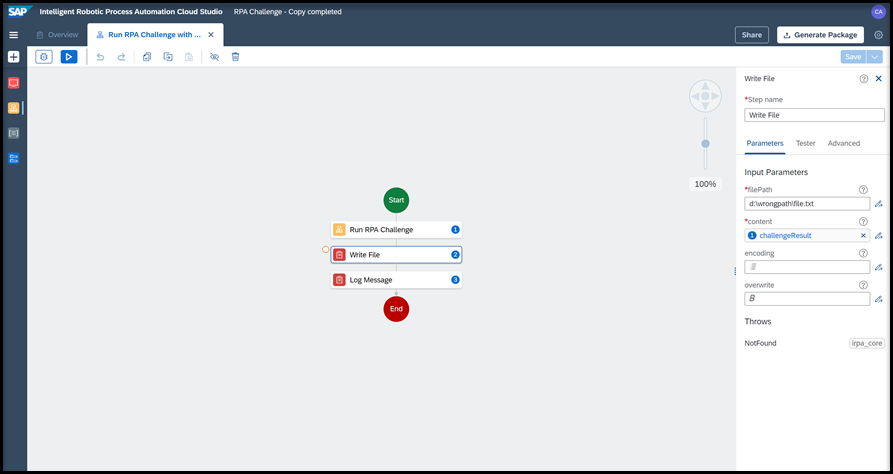
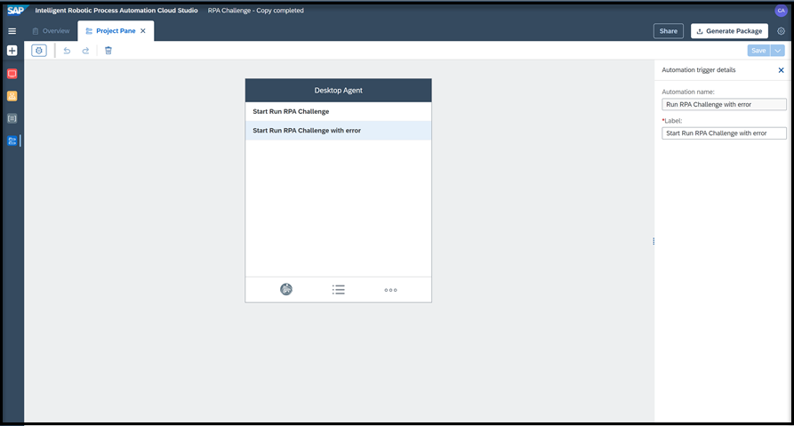

# INT160 - Building a production grade automation in minutes with SAP Intelligent RPA

## Description

This repository contains the material for the SAP TechEd 2021 session called **INT160 - Building a production grade automation in minutes with SAP Intelligent RPA**.

## Overview

This session introduces attendees to SAPs new and simplified Low-Code Cloud Design Studio. Learn how to build a bot to run a very popular RPA Challenge combining a [Web application](http://www.rpachallenge.com) and Microsoft Excel.

- The goal of this workshop is to create a bot that will input data from a downloaded spreadsheet into the form fields on the screen.
- The fields will change position on the screen after every submission throughout 10 rounds thus the automation must correctly identify where each spreadsheet record must be typed every time.
- The actual countdown of the challenge will begin once you click the Start button, until then you may submit the form as many times as you wish without receiving penalties.

## Requirements

A **Windows machine** is required to run the entire workshop.
The requirements to follow the exercises in this repository are described in the [Setup PDF document](exercises/exercise0/Setup%20Trial%20Landscape.pdf).

## Exercises

There are 4 sets of exercises. Exercise 0 is a mandatory setup before executing any exercise. You have to run exercises 1, 2, and 3 in order. These exercises are dependent of each other and the instructions are mentioned in the respective links below.

- [Onboarding to SAP Intelligent RPA Trial](exercises/exercise0/)
    - [Setup PDF document](exercises/exercise0/Setup%20Trial%20Landscape.pdf)
    - Duration: 15 minutes. This is a **MANDATORY** exercise that needs to be completed before the workshop.
    - It will help you setup your SAP Business Technology Platform Trial account with SAP Intelligent RPA. 

- [Exercise 1 - RPA Challenge Application Capture](exercises/exercise1/)
    - [Exercise 1 PDF document](exercises/exercise1/1%20-%20RPA%20Challenge%20Application%20Capture.pdf)
    - Duration: 20 minutes 
    - In this exercise, you will learn how to capture an application running on your local machine. You start by locating the screens you want to use. For the purpose of this exercise, you will select and capture two screens from the [RPA Challenge website](http://www.rpachallenge.com). 
    - Once the screens are captured, you will look at the UI elements you want to control on those screens, such as input fields, output fields, and buttons. These elements will be used in the next exercise : [RPA Challenge Automations](exercises/exercise2/)
    - Another key task is declaration, which means choosing the recognition criteria for the application, screens and UI elements that will be used at run time to correctly identify them.
    

- [Exercise 2 - RPA Challenge Automations](exercises/exercise2/)
- [Exercise 2.1 - First Automation](exercises/exercise2#exercise-21-First-Automation)
    - [Exercise 2.1 PDF document](exercises/exercise2/2.1%20-%20First%20Automation.pdf)
    - Duration: 30 minutes
    - Once the application is declared and the elements you want to work with have been recognized and declared, you can create your automation.
Automations are executed on the Desktop Agent of your local machine.  They are composed of a succession of steps you build in the Cloud Studio with the automation designer. An automation can orchestrate multiple activities on different applications and screens available on a specific computer.
    - In this exercise, you will work on the first part of your automation. The bot you will create will open the [RPA Challenge website](http://www.rpachallenge.com), click on the Download Excel button and if the path entered in the bot (where the excel file should be downloaded) exists, will download it and store it on your computer.
    

- [Exercise 2.2 - Test Download Challenge](exercises/exercise2#exercise-22-Test-Download-Challenge)
    - [Exercise 2.2 PDF document](exercises/exercise2/2.2%20-%20Test%20Download%20Challenge.pdf) 
    - Duration: 10 minutes
    - After completing the first automation, you will test it thanks to the tester side panel. This panel helps you test, troubleshoot but also display the execution flow of your automation.
    - In this exercise, you will learn how to set breakpoints, debug your automation, check the input and output parameters. 
    - This testing will allow you to ensure that the file exists and that the path to the file is given.

- [Exercise 2.3 - Fill Fields Automation](exercises/exercise2#exercise-23-fill-Fields-Automation)
    - [Exercise 2.3 PDF document](exercises/exercise2/2.3%20-%20Fill%20Fields%20Automation.pdf) 
    - Duration: 20 minutes
    - In this second part, you will continue working on the automation. Now that you tested that the file exists and that the path to the file is given, you can direct the bot to open the excel file and read the information in the file.
    - Next, you will create a new automation called Fill fields that you will use as a sub-automation inside the Run RPA Challenge automation. 
    - The Fill Fields automation will use the Main application. You will then define which activities should be performed on the screen such as fill the fields, click start, etc...
    - You will then add the Results application. Similarly you will define the activities that should be performed on the screen such as get the result rate. The result will be then saved as a screenshot on your computer.

- [Exercise 2.4 - Run RPA Challenge with error and Project Pane](exercises/exercise2#exercise-24-Run-RPA-Challenge-with-error-and-Project-Pane)
    - [Exercise 2.4 PDF document](exercises/exercise2/2.4%20-%20Run%20RPA%20Challenge%20with%20error%20and%20Project%20Pane.pdf)
    - Duration: 10 minutes
    - In this exercise you will create an automation with an error. You will use a wrong file path to trigger an error.
   

    - You will then create a Project Pane which allows you to design the agent systray menu directly from the Cloud Studio letting you select the automation you want to launch.

- [Exercise 3 - Deployment & Cold debugging](exercises/exercise3/)
    - [Exercise 3 PDF document](exercises/exercise3/3%20-%20Deployment%20&%20Cold%20debugging.pdf)
    - Duration: 20 minutes 
    - In this exercise, you will learn how to:

## How to obtain support

Support for the content in this repository is available during the actual time of the online session for which this content has been designed. Otherwise, you may request support via the [Issues](../../issues) tab.

## License

Copyright (c) 2021 SAP SE or an SAP affiliate company. All rights reserved. This project is licensed under the Apache Software License, version 2.0 except as noted otherwise in the [LICENSE](LICENSES/Apache-2.0.txt) file.
